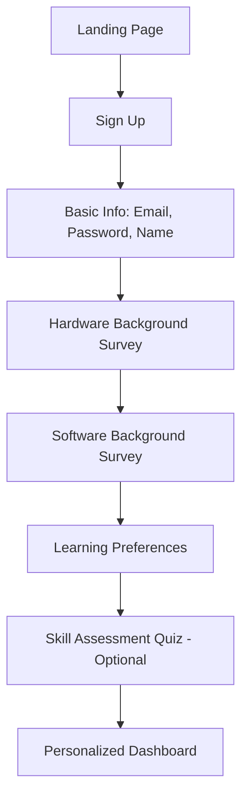

# Constitution for Physical AI and Humanoid Robotics Academic Textbook

**Version:** 1.0
**Last Updated:** 2025-11-29
**Project Type:** Open-Source Academic Textbook Platform
**License:** MIT (Code) + CC BY-SA 4.0 (Content)

---

## I. Project Mission and Scope

### 1.1 Mission Statement
This project delivers a comprehensive, interactive, and personalized academic textbook on Physical AI and Humanoid Robotics, adhering to the highest standards of academic rigor while leveraging modern AI-powered learning technologies.

### 1.2 Core Objectives
- Provide weekly-structured curriculum aligned with PIAIC Quarter 4 syllabus
- Maintain academic excellence through peer-reviewed citations and references
- Enable hands-on learning through executable code examples
- Support multilingual access with Urdu translation
- Personalize learning experiences based on user background and progress
- Ensure content is RAG-indexable for AI-powered assistance

---

## II. Academic Standards and Content Requirements

### 2.1 Academic Rigor
**MANDATORY:** All content must meet academic publication standards.

#### 2.1.1 Citation Requirements
- Every theoretical claim MUST be backed by citations from:
  - Provided PDF resources in the project repository
  - IEEE Xplore publications
  - Peer-reviewed robotics journals (e.g., IJRR, Autonomous Robots)
  - Official ROS 2 and NVIDIA Isaac documentation

- Citation format: **IEEE style**
- Minimum citation density: 3-5 citations per major concept
- All citations must include DOI or stable URL when available

#### 2.1.2 Content Validation
- Technical accuracy verified against official documentation
- Mathematical formulations must include derivations or references
- Claims about hardware/software capabilities must be verifiable
- Code examples must reference official API documentation

#### 2.1.3 Prohibited Content
- Unsubstantiated claims or opinions without citations
- Deprecated APIs or outdated practices without historical context
- Pseudocode where executable code is feasible
- Marketing language or vendor bias

### 2.2 Modular Chapter Structure
**MANDATORY:** Content organized by weekly syllabus modules.

#### 2.2.1 Chapter Organization
```
Week 1-2: Foundations of Physical AI
Week 3-4: Humanoid Robotics Hardware
Week 5-6: Perception and Sensor Fusion
Week 7-8: Motion Planning and Control
Week 9-10: AI Integration and Learning
Week 11-12: Advanced Topics and Projects
```

#### 2.2.2 Chapter Components (Required)
Each chapter MUST contain:
1. **Learning Objectives** (3-5 specific outcomes)
2. **Prerequisites** (linked to previous chapters)
3. **Theoretical Foundation** (with citations)
4. **Practical Implementation** (with code)
5. **Exercises** (3 difficulty levels)
6. **References** (IEEE format bibliography)
7. **Glossary Terms** (for RAG indexing)

#### 2.2.3 Chapter Metadata (Required)
```yaml
---
chapter: 1
week: 1-2
title: "Foundations of Physical AI"
estimated_hours: 8
difficulty: beginner
prerequisites: []
topics:
  - embodied_ai
  - physical_intelligence
  - sensor_motor_loop
rag_keywords:
  - "physical AI definition"
  - "embodied cognition"
  - "sensorimotor control"
urdu_translated: true
last_updated: "2025-11-29"
reviewers:
  - name: "Dr. [Reviewer Name]"
    affiliation: "[Institution]"
---
```

---

## III. Code Standards and Executable Requirements

### 3.1 Code Execution Guarantee
**MANDATORY:** All code snippets must be executable without modification.

#### 3.1.1 Supported Frameworks
- **ROS 2** (Humble or later): All robotics code
- **Python** (3.10+): AI/ML implementations
- **NVIDIA Isaac Sim** (YAML configs): Simulation setups
- **PyTorch** (2.0+): Deep learning models

#### 3.1.2 Code Block Standards
Every code block MUST include:

```python
"""
Module: perception/camera_calibration.py
Description: Calibrate camera intrinsics using OpenCV
Dependencies: opencv-python==4.8.0, numpy==1.24.0
ROS 2 Package: vision_sensors
Isaac Sim Version: 2023.1.0+
Citation: Zhang, Z. (2000). A Flexible New Technique for Camera Calibration.
          IEEE PAMI, 22(11), 1330-1334. DOI: 10.1109/34.888718

Tested on: Ubuntu 22.04, ROS 2 Humble
"""

import cv2
import numpy as np
from typing import List, Tuple

def calibrate_camera(
    image_paths: List[str],
    checkerboard_size: Tuple[int, int] = (9, 6)
) -> dict:
    """
    Calibrate camera using checkerboard pattern.

    Args:
        image_paths: List of calibration image file paths
        checkerboard_size: Inner corners (width, height)

    Returns:
        dict with keys: 'camera_matrix', 'distortion_coeffs', 'rvecs', 'tvecs'

    Example:
        >>> images = glob.glob('calib_images/*.jpg')
        >>> result = calibrate_camera(images)
        >>> print(result['camera_matrix'])
    """
    # Implementation with inline comments...
```

#### 3.1.3 Code Repository Structure
```
code/
├── ros2_packages/
│   ├── humanoid_control/
│   ├── perception_stack/
│   └── navigation/
├── isaac_sim/
│   ├── environments/
│   ├── robots/
│   └── configs/
├── python_examples/
│   ├── week_01/
│   ├── week_02/
│   └── ...
├── requirements.txt
├── ros2.repos
└── README.md (setup instructions)
```

#### 3.1.4 Testing Requirements
- All code must include unit tests (pytest)
- Integration tests for ROS 2 nodes
- CI/CD pipeline must validate all code examples
- Code coverage minimum: 80%

#### 3.1.5 Isaac Sim YAML Standards
```yaml
# environments/humanoid_warehouse.yaml
# Description: Warehouse navigation scenario
# Citation: NVIDIA Isaac Sim Documentation (2024)
# Tested: Isaac Sim 2023.1.0

scene:
  name: "warehouse_navigation"
  physics:
    gravity: [0, 0, -9.81]
    timestep: 0.01

  assets:
    - type: "ground_plane"
      size: [20, 20]
      material: "concrete"

    - type: "humanoid_robot"
      model: "h1_unitree"
      spawn_position: [0, 0, 1.0]
      controller: "whole_body_controller"

  sensors:
    - type: "camera"
      resolution: [1920, 1080]
      fov: 90
      frame_rate: 30
```

---

## IV. RAG and Content Indexing Standards

### 4.1 RAG-Indexable Content Requirements
**MANDATORY:** All content must be optimally structured for semantic search and retrieval.

#### 4.1.1 Semantic Chunking Strategy
- **Chunk size:** 512-1024 tokens (optimal for embedding models)
- **Overlap:** 128 tokens between chunks
- **Boundary rules:** Preserve complete concepts, code blocks, equations
- **Metadata per chunk:**
  ```json
  {
    "chunk_id": "ch03_sec02_p05",
    "chapter": 3,
    "section": "Motion Planning",
    "subsection": "RRT Algorithms",
    "page_number": 87,
    "tokens": 768,
    "keywords": ["RRT", "path planning", "obstacle avoidance"],
    "difficulty": "intermediate",
    "has_code": true,
    "has_equations": true,
    "citations": ["LaValle1998", "Karaman2011"],
    "urdu_available": true
  }
  ```

#### 4.1.2 Prohibited Content Formats
**FORBIDDEN:** Content that cannot be semantically indexed:
- ❌ Text embedded in images (use alt text + caption)
- ❌ Scanned PDFs without OCR
- ❌ Hand-drawn diagrams without descriptions
- ❌ Tables as images (use Markdown tables)
- ❌ Equations as images (use LaTeX/MathJax)

#### 4.1.3 Required Content Formats
**MANDATORY:** Use semantic-friendly formats:
- ✅ Markdown for text content
- ✅ LaTeX for equations: `$$E = mc^2$$`
- ✅ Mermaid for diagrams (with text descriptions)
- ✅ SVG for technical illustrations (with aria-labels)
- ✅ Code blocks with language tags and docstrings
- ✅ Structured data in YAML/JSON

#### 4.1.4 Image Accessibility Standards
When images are necessary:
```markdown


**Figure 3.4:** Kinematic chain of a 12-DOF humanoid robot showing joint
axes (blue), link frames (red), and center of mass positions (green).
The robot has 6 DOF in each leg: hip (3), knee (1), ankle (2).

**Text Description:** The diagram illustrates a frontal view of a humanoid
robot with labeled joints J1-J12. Starting from the torso (fixed frame),
each leg branches with: hip flexion/extension (J1, J7), hip
abduction/adduction (J2, J8), hip rotation (J3, J9), knee flexion (J4, J10),
ankle dorsiflexion (J5, J11), and ankle inversion/eversion (J6, J12).

**Urdu Description:** یہ ڈایاگرام ایک ہیومینائیڈ روبوٹ کی سامنے کی تصویر...
```

#### 4.1.5 Glossary and Ontology
- Maintain `glossary.yaml` with term definitions
- Link terms to DBpedia/Wikidata URIs for semantic web compatibility
- Include Urdu translations for all technical terms
```yaml
terms:
  - term: "inverse kinematics"
    definition: "Computing joint angles to achieve desired end-effector pose"
    citation: "Siciliano2009"
    related: ["forward_kinematics", "jacobian"]
    urdu: "الٹی حرکیات"
    uri: "http://dbpedia.org/resource/Inverse_kinematics"
```

---

## V. User Interface and Personalization

### 5.1 Docusaurus v3 Configuration
**MANDATORY:** Frontend built on Docusaurus v3 with specified stack.

#### 5.1.1 Tech Stack Requirements
```json
{
  "framework": "docusaurus@3.x",
  "styling": "tailwindcss@3.x",
  "state_management": "zustand@4.x",
  "i18n": "docusaurus-plugin-i18n",
  "search": "docusaurus-search-local",
  "analytics": "plausible-analytics",
  "code_highlighting": "prism-react-renderer"
}
```

#### 5.1.2 Tailwind Configuration
```javascript
// tailwind.config.js
module.exports = {
  content: ['./src/**/*.{js,jsx,ts,tsx}', './docs/**/*.{md,mdx}'],
  theme: {
    extend: {
      colors: {
        primary: '#1E40AF',    // Blue for robotics theme
        secondary: '#DC2626',  // Red accents
        urdu: '#059669'        // Green for Urdu mode
      },
      fontFamily: {
        sans: ['Inter', 'system-ui'],
        mono: ['Fira Code', 'monospace'],
        urdu: ['Noto Nastaliq Urdu', 'serif']
      }
    }
  },
  plugins: [require('@tailwindcss/typography')]
}
```

#### 5.1.3 Zustand Store Structure
```typescript
// src/store/userStore.ts
interface UserProfile {
  id: string
  background: {
    hardware_experience: 'none' | 'beginner' | 'intermediate' | 'advanced'
    software_experience: 'none' | 'beginner' | 'intermediate' | 'advanced'
    programming_languages: string[]
    robotics_platforms: string[]
    education_level: string
  }
  preferences: {
    language: 'en' | 'ur'
    difficulty_preference: 'beginner' | 'intermediate' | 'advanced'
    code_language_preference: 'python' | 'cpp'
    theme: 'light' | 'dark'
    font_size: number
  }
  progress: {
    completed_chapters: number[]
    current_chapter: number
    exercise_scores: Record<string, number>
    time_spent_minutes: number
  }
}

export const useUserStore = create<UserProfile>((set) => ({
  // Store implementation
}))
```

### 5.2 Personalization Engine
**MANDATORY:** Content adaptation based on user profile.

#### 5.2.1 Adaptive Content Levels
System must dynamically adjust:
- **Beginner:** More explanations, simpler code, step-by-step
- **Intermediate:** Balanced theory/practice, optimized code
- **Advanced:** Concise explanations, research-level content, optimization focus

#### 5.2.2 Personalization Rules
```yaml
personalization_rules:
  - condition: "user.background.hardware_experience == 'none'"
    action: "show_hardware_primer_sections"

  - condition: "user.background.software_experience == 'advanced'"
    action: "hide_basic_python_explanations"

  - condition: "'ROS' not in user.background.robotics_platforms"
    action: "add_ros2_fundamentals_prerequisite"

  - condition: "user.preferences.language == 'ur'"
    action: "load_urdu_translations_by_default"

  - condition: "user.progress.exercise_scores[chapter_id] < 60"
    action: "suggest_review_materials"
```

#### 5.2.3 UI Components for Personalization
```typescript
// src/components/AdaptiveContent.tsx
<AdaptiveContent>
  <ForBeginners>
    <HardwarePrimer />
    <DetailedExplanation />
  </ForBeginners>

  <ForIntermediate>
    <StandardExplanation />
    <CodeComparison />
  </ForIntermediate>

  <ForAdvanced>
    <ConciseReference />
    <PerformanceAnalysis />
    <ResearchPapers />
  </ForAdvanced>
</AdaptiveContent>
```

### 5.3 Urdu Translation Requirements
**MANDATORY:** Full Urdu language support.

#### 5.3.1 Translation Scope
Must translate:
- ✅ All UI elements and navigation
- ✅ Chapter titles and section headings
- ✅ Theoretical explanations and concepts
- ✅ Exercise instructions
- ✅ Code comments (where pedagogically valuable)
- ✅ Error messages and tooltips
- ✅ Glossary terms

May remain in English:
- ✅ Code syntax and keywords
- ✅ Variable names in code
- ✅ Technical terms without Urdu equivalents (with transliteration)
- ✅ URLs and file paths

#### 5.3.2 Urdu Typography Standards
```css
/* Urdu-specific styles */
.urdu-content {
  font-family: 'Noto Nastaliq Urdu', serif;
  font-size: 1.25em; /* 25% larger for readability */
  line-height: 2;    /* Increased line spacing */
  text-align: right; /* RTL alignment */
  direction: rtl;
}

.urdu-code-comment {
  font-family: 'Noto Nastaliq Urdu', monospace;
  direction: rtl;
}
```

#### 5.3.3 Translation Quality Standards
- Professional human translation (not machine-only)
- Technical review by Urdu-speaking robotics experts
- Consistent terminology across all chapters
- Maintain technical accuracy in translation

#### 5.3.4 i18n File Structure
```
i18n/
├── en/
│   ├── docusaurus-plugin-content-docs/
│   │   └── current/
│   │       ├── week-01/
│   │       └── ...
│   └── docusaurus-theme-classic/
│       └── navbar.json
└── ur/
    ├── docusaurus-plugin-content-docs/
    │   └── current/
    │       ├── week-01/
    │       └── ...
    └── docusaurus-theme-classic/
        └── navbar.json
```

---

## VI. Authentication and User Onboarding

### 6.1 Authentication Requirements
**MANDATORY:** Collect hardware/software background at signup.

#### 6.1.1 Required Signup Fields
```typescript
interface SignupForm {
  // Basic info
  email: string          // Required, validated
  password: string       // Min 12 chars, complexity requirements
  full_name: string      // Required

  // Hardware background (Required)
  hardware_experience: 'none' | 'beginner' | 'intermediate' | 'advanced'
  hardware_platforms_used: string[]  // e.g., ["Arduino", "Raspberry Pi", "STM32"]
  has_robot_access: boolean
  robot_type?: string   // If has_robot_access

  // Software background (Required)
  software_experience: 'none' | 'beginner' | 'intermediate' | 'advanced'
  programming_languages: string[]  // Min 1 required
  familiar_with_ros: boolean
  ros_version?: string  // If familiar_with_ros

  // Education/background
  education_level: 'high_school' | 'undergraduate' | 'graduate' | 'phd' | 'professional'
  field_of_study?: string
  current_role: 'student' | 'researcher' | 'engineer' | 'hobbyist' | 'other'

  // Learning preferences
  preferred_language: 'en' | 'ur'
  learning_goal: string  // Free text
  weekly_time_commitment: number  // Hours per week
}
```

#### 6.1.2 Onboarding Flow


#### 6.1.3 Skill Assessment (Optional)
- 10-question adaptive quiz
- Covers: Python basics, robotics concepts, ROS fundamentals
- Results refine difficulty level recommendation
- Can be skipped but encouraged

#### 6.1.4 Auth Provider
```typescript
// Use Clerk.dev or similar with custom fields
import { SignUp } from "@clerk/nextjs"

<SignUp
  appearance={{
    elements: {
      formFieldInput: "rounded-lg border-2",
      footerAction: "hidden"
    }
  }}
  additionalFields={[
    {
      name: "hardware_experience",
      type: "dropdown",
      required: true,
      options: [...]
    },
    // Additional custom fields
  ]}
/>
```

---

## VII. Backend Architecture and Data Layer

### 7.1 Required Technology Stack
**MANDATORY:** Backend services and databases.

#### 7.1.1 Database Layer
```yaml
databases:
  neon_postgres:
    purpose: "Primary relational database"
    schema:
      - users
      - user_profiles
      - progress_tracking
      - exercise_submissions
      - analytics_events
    features:
      - Serverless auto-scaling
      - Branch databases for dev/staging
      - Point-in-time recovery

  qdrant:
    purpose: "Vector database for RAG"
    collections:
      - textbook_content_embeddings
      - code_snippets_embeddings
      - urdu_translations_embeddings
    config:
      vector_size: 1536  # OpenAI ada-002
      distance: "Cosine"
      index_type: "HNSW"
```

#### 7.1.2 Postgres Schema (Core Tables)
```sql
-- users table (managed by auth provider)
CREATE TABLE users (
    id UUID PRIMARY KEY DEFAULT gen_random_uuid(),
    email VARCHAR(255) UNIQUE NOT NULL,
    created_at TIMESTAMP DEFAULT NOW()
);

-- user_profiles table
CREATE TABLE user_profiles (
    user_id UUID PRIMARY KEY REFERENCES users(id),
    full_name VARCHAR(255) NOT NULL,

    -- Hardware background
    hardware_experience VARCHAR(20) NOT NULL CHECK (hardware_experience IN ('none', 'beginner', 'intermediate', 'advanced')),
    hardware_platforms TEXT[], -- Array of platforms
    has_robot_access BOOLEAN DEFAULT FALSE,
    robot_type VARCHAR(100),

    -- Software background
    software_experience VARCHAR(20) NOT NULL CHECK (software_experience IN ('none', 'beginner', 'intermediate', 'advanced')),
    programming_languages TEXT[] NOT NULL,
    familiar_with_ros BOOLEAN DEFAULT FALSE,
    ros_version VARCHAR(20),

    -- Education
    education_level VARCHAR(30),
    field_of_study VARCHAR(100),
    current_role VARCHAR(30),

    -- Preferences
    preferred_language CHAR(2) DEFAULT 'en',
    theme VARCHAR(10) DEFAULT 'light',

    updated_at TIMESTAMP DEFAULT NOW()
);

-- progress_tracking table
CREATE TABLE progress_tracking (
    id SERIAL PRIMARY KEY,
    user_id UUID REFERENCES users(id),
    chapter_id INTEGER NOT NULL,
    section_id VARCHAR(50),
    status VARCHAR(20) CHECK (status IN ('not_started', 'in_progress', 'completed')),
    time_spent_seconds INTEGER DEFAULT 0,
    last_accessed TIMESTAMP DEFAULT NOW(),
    completed_at TIMESTAMP,

    UNIQUE(user_id, chapter_id, section_id)
);

-- exercise_submissions table
CREATE TABLE exercise_submissions (
    id SERIAL PRIMARY KEY,
    user_id UUID REFERENCES users(id),
    exercise_id VARCHAR(100) NOT NULL,
    submission_code TEXT,
    result JSONB, -- Test results
    score INTEGER,
    submitted_at TIMESTAMP DEFAULT NOW(),
    feedback TEXT
);

-- Create indexes
CREATE INDEX idx_progress_user ON progress_tracking(user_id);
CREATE INDEX idx_submissions_user ON exercise_submissions(user_id);
CREATE INDEX idx_submissions_exercise ON exercise_submissions(exercise_id);
```

#### 7.1.3 Qdrant Collections
```python
# Initialize Qdrant collections
from qdrant_client import QdrantClient
from qdrant_client.models import Distance, VectorParams, PayloadSchemaType

client = QdrantClient(url=os.getenv("QDRANT_URL"))

# Textbook content collection
client.create_collection(
    collection_name="textbook_content",
    vectors_config=VectorParams(
        size=1536,
        distance=Distance.COSINE
    )
)

# Payload schema for semantic search
payload_schema = {
    "chunk_id": PayloadSchemaType.KEYWORD,
    "chapter": PayloadSchemaType.INTEGER,
    "section": PayloadSchemaType.KEYWORD,
    "content_type": PayloadSchemaType.KEYWORD,  # text, code, equation
    "language": PayloadSchemaType.KEYWORD,       # en, ur
    "difficulty": PayloadSchemaType.KEYWORD,
    "has_code": PayloadSchemaType.BOOL,
    "keywords": PayloadSchemaType.KEYWORD,
    "citations": PayloadSchemaType.KEYWORD
}
```

### 7.2 OpenAI Agents SDK Integration
**MANDATORY:** Use OpenAI Agents SDK for intelligent features.

#### 7.2.1 Required Subagents
```yaml
subagents:
  tutor_agent:
    purpose: "Answer student questions about concepts"
    capabilities:
      - RAG over textbook content
      - Code explanation
      - Exercise hints
      - Urdu language support
    tools:
      - qdrant_search
      - code_executor
      - citation_lookup

  code_review_agent:
    purpose: "Review student exercise submissions"
    capabilities:
      - Syntax checking
      - Logic verification
      - Performance analysis
      - Security auditing
    tools:
      - python_sandbox
      - ros2_validator
      - static_analyzer

  personalization_agent:
    purpose: "Adapt content to user level"
    capabilities:
      - Difficulty assessment
      - Learning path optimization
      - Resource recommendation
    tools:
      - postgres_query
      - progress_analyzer

  translation_agent:
    purpose: "Handle Urdu translations dynamically"
    capabilities:
      - Technical term translation
      - Context-aware translation
      - Quality validation
    tools:
      - openai_translation
      - terminology_database
```

#### 7.2.2 Agent Implementation Structure
```python
from openai import OpenAI
from openai.agents import Agent, Tool

# Tutor Agent
tutor_agent = Agent(
    name="Robotics Tutor",
    instructions="""
    You are an expert robotics tutor helping students learn Physical AI
    and Humanoid Robotics.

    - Always cite sources from the textbook
    - Provide code examples when relevant
    - Adapt explanations to user's background level
    - Support both English and Urdu
    - Use Socratic method for conceptual questions
    """,
    tools=[
        Tool(
            name="search_textbook",
            description="Search textbook content using semantic similarity",
            function=search_qdrant_collection
        ),
        Tool(
            name="execute_code",
            description="Run Python/ROS 2 code snippets safely",
            function=execute_in_sandbox
        ),
        Tool(
            name="get_citations",
            description="Retrieve full citation details",
            function=fetch_citations_from_db
        )
    ],
    model="gpt-4-turbo-preview"
)

# Code Review Agent
code_review_agent = Agent(
    name="Code Reviewer",
    instructions="""
    Review student code submissions for robotics exercises.

    - Check syntax and runtime errors
    - Verify ROS 2 best practices
    - Assess algorithmic correctness
    - Provide constructive feedback
    - Score based on rubric
    """,
    tools=[
        Tool(name="run_tests", function=execute_unit_tests),
        Tool(name="static_analysis", function=run_pylint_ruff),
        Tool(name="security_scan", function=bandit_security_scan)
    ],
    model="gpt-4-turbo-preview"
)
```

#### 7.2.3 Agent API Endpoints
```typescript
// API routes for agent interactions
POST /api/agents/tutor/ask
Body: {
  question: string
  chapter_context?: number
  language: 'en' | 'ur'
}

POST /api/agents/code-review/submit
Body: {
  exercise_id: string
  code: string
  language: 'python' | 'cpp'
}

GET /api/agents/personalization/recommendations
Query: {
  user_id: string
}
```

### 7.3 Backend Service Architecture
```
backend/
├── services/
│   ├── auth/              # Authentication & authorization
│   ├── user-profile/      # Profile management
│   ├── content/           # Content delivery
│   ├── progress/          # Progress tracking
│   ├── exercises/         # Exercise submission & grading
│   ├── rag/               # RAG pipeline
│   └── agents/            # OpenAI agent orchestration
├── db/
│   ├── migrations/        # Postgres migrations
│   ├── seeds/             # Initial data
│   └── queries/           # Prepared queries
├── embeddings/
│   ├── generate.py        # Generate embeddings
│   ├── index.py           # Index to Qdrant
│   └── update.py          # Incremental updates
└── api/
    ├── routes/
    └── middleware/
```

---

## VIII. Mandatory Features Implementation

### 8.1 Feature Checklist
**MANDATORY:** All features must be implemented before v1.0 release.

```yaml
mandatory_features:
  content:
    - ✓ 12 weeks of modular chapters
    - ✓ Citations for all theoretical content
    - ✓ Executable code for all examples
    - ✓ ROS 2 Humble compatibility
    - ✓ Isaac Sim YAML configs
    - ✓ RAG-optimized chunking
    - ✓ Complete Urdu translations

  frontend:
    - ✓ Docusaurus v3 setup
    - ✓ Tailwind CSS integration
    - ✓ Zustand state management
    - ✓ Responsive design (mobile, tablet, desktop)
    - ✓ Dark mode support
    - ✓ RTL layout for Urdu
    - ✓ Accessibility (WCAG 2.1 AA)

  backend:
    - ✓ Neon Postgres database
    - ✓ Qdrant vector store
    - ✓ OpenAI Agents SDK integration
    - ✓ RESTful API with OpenAPI spec
    - ✓ Rate limiting & caching

  personalization:
    - ✓ Background-based content adaptation
    - ✓ Difficulty level adjustment
    - ✓ Learning path recommendations
    - ✓ Progress tracking dashboard

  authentication:
    - ✓ Email/password signup
    - ✓ OAuth providers (Google, GitHub)
    - ✓ Hardware/software survey
    - ✓ Skill assessment quiz

  ai_features:
    - ✓ Tutor agent (Q&A)
    - ✓ Code review agent
    - ✓ Personalization agent
    - ✓ Translation agent
    - ✓ RAG-powered search

  urdu_support:
    - ✓ Full UI translation
    - ✓ Content translation (all chapters)
    - ✓ Urdu-specific typography
    - ✓ RTL layout support
    - ✓ Urdu code comments (optional)
```

### 8.2 Bonus Features (Now Mandatory)
These were originally bonus but are now **required**:

1. **Advanced Personalization**
   - Adaptive difficulty based on exercise performance
   - Personalized resource recommendations
   - Learning style detection

2. **Complete Urdu Translation**
   - Professional translation of all content
   - Technical term glossary
   - Audio pronunciations (optional)

3. **Multi-Agent System**
   - Tutor agent
   - Code review agent
   - Personalization agent
   - Translation agent
   - Orchestration between agents

---

## IX. Quality Assurance and Testing

### 9.1 Testing Requirements
**MANDATORY:** Comprehensive testing before deployment.

#### 9.1.1 Code Testing
```yaml
code_tests:
  unit_tests:
    framework: pytest
    coverage_minimum: 80%
    scope: All Python functions

  integration_tests:
    framework: pytest + ros2test
    scope: ROS 2 node interactions

  end_to_end_tests:
    framework: Playwright
    scope: User flows (signup, chapter completion, exercise submission)

  code_execution_tests:
    scope: Every code snippet in textbook
    validation: Must run without errors
```

#### 9.1.2 Content Quality Checks
```yaml
content_validation:
  citation_checker:
    - Verify all citations exist
    - Check DOI/URL validity
    - Validate IEEE format

  link_checker:
    - All internal links resolve
    - External links return 200

  code_validator:
    - All code blocks have language tags
    - All code executes successfully
    - All dependencies listed

  translation_validator:
    - Urdu translations complete
    - Technical accuracy maintained
    - RTL formatting correct
```

#### 9.1.3 Accessibility Testing
- WCAG 2.1 AA compliance
- Screen reader compatibility (NVDA, JAWS)
- Keyboard navigation
- Color contrast validation
- Urdu text readability

### 9.2 Performance Standards
```yaml
performance_requirements:
  page_load:
    first_contentful_paint: < 1.5s
    time_to_interactive: < 3.0s
    largest_contentful_paint: < 2.5s

  api_response:
    p50: < 200ms
    p95: < 500ms
    p99: < 1000ms

  rag_search:
    semantic_search: < 300ms
    citation_lookup: < 100ms

  agent_response:
    tutor_agent: < 3s
    code_review_agent: < 5s
```

---

## X. Deployment and DevOps

### 10.1 Infrastructure Requirements
```yaml
infrastructure:
  frontend:
    platform: Vercel / Netlify
    cdn: Cloudflare
    ssl: Required

  backend:
    platform: Railway / Fly.io
    containers: Docker
    orchestration: Docker Compose / Kubernetes (optional)

  databases:
    postgres: Neon (serverless)
    vector_db: Qdrant Cloud

  monitoring:
    apm: Sentry
    logs: Better Stack
    uptime: UptimeRobot
```

### 10.2 CI/CD Pipeline
```yaml
cicd:
  triggers:
    - push to main
    - pull request

  stages:
    - lint (eslint, prettier, ruff)
    - type_check (typescript, mypy)
    - unit_tests
    - integration_tests
    - build (frontend, backend)
    - code_execution_validation
    - deploy_staging
    - e2e_tests_staging
    - deploy_production (if main branch)

  tools:
    - GitHub Actions / GitLab CI
```

---

## XI. Documentation Standards

### 11.1 Required Documentation
```yaml
documentation:
  user_facing:
    - Getting Started Guide
    - Installation Instructions (ROS 2, Isaac Sim)
    - FAQ
    - Troubleshooting Guide
    - API Documentation (Swagger/OpenAPI)

  developer_facing:
    - Architecture Overview
    - Contributing Guidelines (CONTRIBUTING.md)
    - Code Style Guide
    - Database Schema Documentation
    - Agent System Documentation
    - Deployment Guide

  academic:
    - Syllabus Mapping
    - Learning Outcomes
    - Assessment Rubrics
    - Citation Guidelines
```

### 11.2 Code Documentation Standards
```python
"""
Module: humanoid_control.whole_body_controller

This module implements a whole-body controller for humanoid robots using
quadratic programming (QP) optimization to solve for joint torques.

References:
    [1] Sentis, L., & Khatib, O. (2005). Synthesis of whole-body behaviors
        through hierarchical control of behavioral primitives. IJRR, 24(11).
        DOI: 10.1177/0278364905058563

Dependencies:
    - ROS 2 Humble
    - quadprog==0.1.11
    - numpy==1.24.0

Author: [Name] <email>
License: MIT
Last Updated: 2025-11-29
"""
```

---

## XII. Governance and Contribution

### 12.1 Open Source Governance
```yaml
governance:
  license:
    code: MIT
    content: CC BY-SA 4.0

  maintainers:
    - Lead Maintainer (project direction)
    - Content Maintainer (academic quality)
    - Code Maintainer (technical quality)
    - Community Maintainer (issues, PRs)

  contribution_process:
    - Fork repository
    - Create feature branch
    - Follow code/content standards
    - Submit PR with description
    - Pass CI/CD checks
    - Receive 2 approvals
    - Merge
```

### 12.2 Content Contribution Guidelines
- All contributions must include citations
- Code must pass execution tests
- Translations must be reviewed by native speakers
- Academic contributions reviewed by domain experts

---

## XIII. Versioning and Maintenance

### 13.1 Version Numbering
```
MAJOR.MINOR.PATCH
Example: 1.2.3

MAJOR: Breaking changes (new syllabus structure)
MINOR: New chapters, features (new agent)
PATCH: Bug fixes, typos, citation updates
```

### 13.2 Update Schedule
```yaml
updates:
  content:
    frequency: Quarterly
    triggers:
      - New research publications
      - ROS 2 version updates
      - Isaac Sim updates

  dependencies:
    frequency: Monthly
    scope: Security patches, bug fixes

  translations:
    frequency: Bi-annually
    scope: Quality improvements
```

---

## XIV. Success Metrics

### 14.1 Quantitative Metrics
```yaml
kpis:
  user_engagement:
    - Daily Active Users (DAU)
    - Chapter completion rate
    - Exercise submission rate
    - Average time per chapter

  content_quality:
    - Citation density (target: >3 per concept)
    - Code execution success rate (target: 100%)
    - Translation coverage (target: 100%)

  technical_performance:
    - Page load time (target: <2s)
    - API response time (target: <500ms)
    - Agent response time (target: <5s)
    - Uptime (target: 99.9%)

  learning_outcomes:
    - Exercise pass rate
    - Pre/post assessment improvement
    - Project completion rate
```

### 14.2 Qualitative Metrics
- User satisfaction surveys
- Academic peer reviews
- Community feedback
- Industry adoption

---

## XV. Compliance and Legal

### 15.1 Data Privacy
- GDPR compliance (EU users)
- CCPA compliance (California users)
- Data retention policies
- User data export/deletion

### 15.2 Accessibility
- WCAG 2.1 AA compliance
- Section 508 compliance (US)

### 15.3 Academic Integrity
- Proper attribution of sources
- Plagiarism prevention
- Open source license compliance

---

## XVI. Amendment Process

### 16.1 Constitution Updates
This constitution may be amended through:
1. Proposal by any maintainer
2. Community discussion (minimum 2 weeks)
3. Vote by maintainers (2/3 majority required)
4. Version bump and changelog entry

### 16.2 Ratification
This constitution is ratified as of **2025-11-29** and applies to all contributions and deployments of the Physical AI and Humanoid Robotics Textbook project.

---

**Signatories:**
- Project Lead: [To be assigned]
- Technical Lead: [To be assigned]
- Academic Advisor: [To be assigned]
- Community Representative: [To be assigned]

**Version History:**
- v1.0 (2025-11-29): Initial constitution

---

## Appendix A: Technology Stack Summary

```yaml
frontend:
  framework: Docusaurus v3.x
  styling: Tailwind CSS v3.x
  state: Zustand v4.x
  i18n: docusaurus-plugin-i18n

backend:
  runtime: Node.js 20+ / Python 3.10+
  api: Express.js / FastAPI
  agents: OpenAI Agents SDK

databases:
  relational: Neon Postgres
  vector: Qdrant
  cache: Redis (optional)

ai_ml:
  embeddings: OpenAI text-embedding-ada-002
  llm: GPT-4-turbo
  agents: OpenAI Agents SDK

robotics:
  middleware: ROS 2 Humble
  simulation: NVIDIA Isaac Sim 2023.1.0+
  languages: Python 3.10+, C++17

devops:
  ci_cd: GitHub Actions
  hosting: Vercel (frontend), Railway (backend)
  monitoring: Sentry, Better Stack
  analytics: Plausible
```

## Appendix B: File Structure Template

```
humanoid_ai_textbook/
├── frontend/                    # Docusaurus site
│   ├── docs/                   # Markdown content
│   │   ├── week-01/
│   │   ├── week-02/
│   │   └── ...
│   ├── i18n/                   # Urdu translations
│   ├── src/
│   │   ├── components/
│   │   ├── pages/
│   │   └── store/              # Zustand stores
│   └── docusaurus.config.js
│
├── backend/                     # Backend services
│   ├── services/
│   ├── agents/                 # OpenAI agents
│   ├── db/
│   └── api/
│
├── code/                        # Executable code examples
│   ├── ros2_packages/
│   ├── isaac_sim/
│   └── python_examples/
│
├── scripts/                     # Build & deployment
│   ├── generate_embeddings.py
│   ├── validate_citations.py
│   └── test_code_execution.py
│
├── docs/                        # Project documentation
│   ├── ARCHITECTURE.md
│   ├── CONTRIBUTING.md
│   └── DEPLOYMENT.md
│
├── tests/                       # Test suites
│   ├── unit/
│   ├── integration/
│   └── e2e/
│
├── CONSTITUTION.md              # This file
├── LICENSE                      # MIT + CC BY-SA 4.0
├── README.md
└── package.json / pyproject.toml
```

---

**END OF CONSTITUTION**

This constitution serves as the authoritative specification for the Physical AI and Humanoid Robotics Academic Textbook project. All contributors, maintainers, and users are bound by these standards and requirements.
