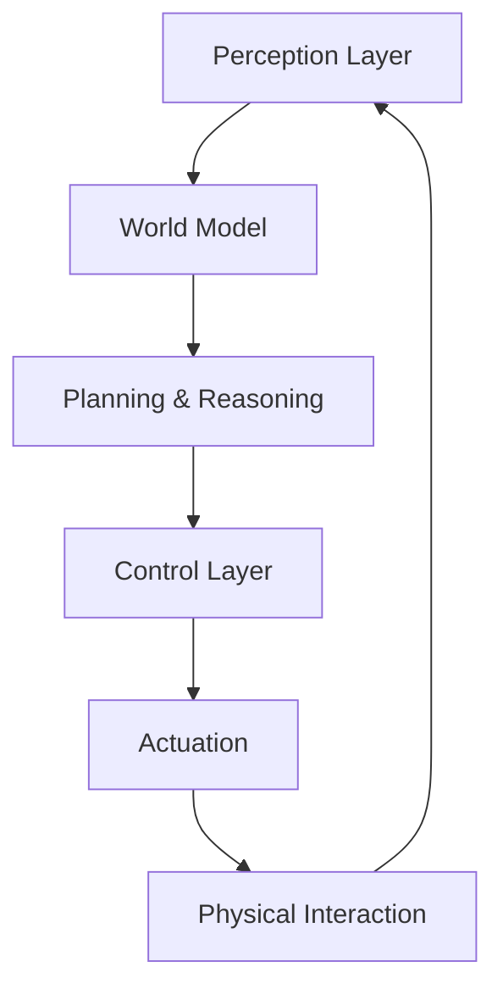

import Tabs from '@theme/Tabs';
import TabItem from '@theme/TabItem';
import {PersonalizedChapter} from '@site/src/components/PersonalizedChapter';


# Foundations of Physical AI & Embodied Intelligence

## Learning Outcomes

By the end of this module, you will be able to:

1. **Define** Physical AI and distinguish it from conventional software AI and traditional robotics
2. **Explain** the "Brain-Cerebellum-Limbs" architecture for humanoid systems
3. **Analyze** the evolution from human-looking → human-like → human-level intelligence
4. **Identify** key vendors and their approaches (Tesla, Boston Dynamics, Figure AI, Unitree)
5. **Describe** the role of world models in physical intelligence
6. **Assess** safety and ethical considerations in embodied AI systems

---

## 1.1 What is Physical AI?

### Defining Physical AI

**Physical AI** represents the convergence of artificial intelligence with robotic embodiment, enabling systems to perceive, reason about, and interact with the physical world [1]. Unlike purely digital AI (chatbots, recommendation systems), Physical AI must:

- **Sense** the environment through cameras, LiDAR, tactile sensors, proprioception
- **Understand** 3D space, physics, object properties, and human intent
- **Act** through actuators to manipulate objects and navigate terrain
- **Learn** from physical interaction, adapting to variability and uncertainty

> **Arthur D. Little (2025)**: "Physical AI differs from conventional robotics by leveraging foundation models, world models, and real-time learning to handle unstructured environments without exhaustive pre-programming." [2, p. 4]

### The Physical AI Stack



**Figure 1.1**: The Physical AI feedback loop. Perception informs world models, which enable planning. Actions affect the environment, creating new observations.

---

## 1.2 Brain-Cerebellum-Limbs Architecture

### China Unicom's Three-Layer Framework

The China Unicom report (2025) proposes a biologically-inspired architecture [3]:

#### 1. **Brain (Intelligence Layer)**
- **Function**: High-level cognition, task planning, decision-making
- **Technologies**: Large Language Models (LLMs), Vision-Language Models (VLMs), Vision-Language-Action (VLA) models
- **Examples**: GPT-4 for task understanding, RT-2 for action generation

#### 2. **Cerebellum (Control Layer)**
- **Function**: Motion control, balance, coordination, reflexes
- **Technologies**: Model Predictive Control (MPC), whole-body controllers, reinforcement learning policies
- **Examples**: Zero-Moment Point (ZMP) for bipedal balance, impedance control for manipulation

#### 3. **Limbs (Hardware Layer)**
- **Function**: Physical actuation, sensing, power systems
- **Technologies**: Electric/hydraulic actuators, sensors (IMU, force/torque, cameras), batteries
- **Examples**: Tesla Optimus Gen 2 (11-DOF hands), Unitree H1 (quasi-direct drive)

```python
# Conceptual implementation of Brain-Cerebellum-Limbs
class HumanoidRobot:
    def __init__(self):
        # Brain: High-level cognition
        self.brain = VLAModel(model="rt-2")  # Vision-Language-Action

        # Cerebellum: Motion control
        self.cerebellum = WholeBodyController()

        # Limbs: Hardware interface
        self.limbs = HardwareInterface(
            actuators=["hip", "knee", "ankle", "shoulder", "elbow", "wrist"],
            sensors=["camera", "imu", "force_torque"]
        )

    def execute_task(self, instruction: str):
        """Execute natural language task."""
        # Brain: Understand task and plan actions
        action_sequence = self.brain.plan(instruction)

        for action in action_sequence:
            # Cerebellum: Generate motor commands
            joint_trajectories = self.cerebellum.compute(action)

            # Limbs: Execute physical motion
            self.limbs.actuate(joint_trajectories)

            # Feedback loop
            sensor_data = self.limbs.sense()
            self.cerebellum.update_state(sensor_data)
```

**Code Snippet 1.1**: High-level structure of a humanoid robot following the Brain-Cerebellum-Limbs paradigm. Full implementation in Week 13.

---

## 1.3 Evolution of Humanoid Intelligence

### The ACM Survey Framework [4]

The ACM Survey on Humanoid Robots (DOI: 10.1145/3770574) identifies three evolutionary stages:

#### Stage 1: **Human-Looking** (1973-2010)
- **Focus**: Anthropomorphic appearance
- **Capabilities**: Pre-programmed motions, limited autonomy
- **Examples**: WABOT-1 (1973), Honda ASIMO (2000-2018)
- **Limitations**: Scripted behaviors, no generalization

**WABOT-1 (Waseda University, 1973)**:
- First full-scale humanoid robot
- Could walk at 45 seconds per step
- Conversational ability in Japanese (limited vocabulary)
- Manipulation: Gripping force 10N

#### Stage 2: **Human-Like** (2010-2024)
- **Focus**: Human-analogous behaviors (walking, manipulation, interaction)
- **Capabilities**: Adaptive control, learning from demonstrations
- **Examples**: Boston Dynamics Atlas (backflips, parkour), Unitree H1 (3.3 m/s running)
- **Key Innovation**: Dynamic locomotion, compliant control

**Boston Dynamics Atlas Evolution [5]**:
- 2013 (DRC version): Hydraulic, 156 kg, cable-tethered
- 2016: Wireless, improved balance, navigation
- 2023: Backflips, parkour, object manipulation
- 2024: Electric version announced (lighter, quieter)

#### Stage 3: **Human-Level** (2024+)
- **Focus**: General-purpose intelligence, reasoning, common sense
- **Capabilities**: Zero-shot task execution, natural language interaction, long-horizon planning
- **Examples**: Figure 01 with OpenAI VLA, Tesla Optimus Gen 2
- **Enabling Technology**: Foundation models (GPT-4, CLIP, RT-2)

---

## 1.4 Physical AI vs. Conventional Robotics

| Aspect | Conventional Robotics | Physical AI |
|--------|----------------------|-------------|
| **Programming** | Explicit rules, state machines | Learned policies, foundation models |
| **Adaptation** | Requires re-programming | Online learning, sim-to-real transfer |
| **Generalization** | Task-specific | Zero-shot to novel objects/tasks |
| **Interaction** | Structured environments | Unstructured, human-centric spaces |
| **Compute** | Centralized (factory servers) | Edge (on-robot GPUs) + cloud [2, p. 12] |
| **Example** | KUKA arm welding car frames | Humanoid folding laundry at home |

**Arthur D. Little Key Insight**: "Physical AI's competitive advantage lies in handling uncertainty through world models—learned representations of physics, object properties, and dynamics—rather than exhaustive pre-programming." [2, p. 8]

---

## 1.5 World Models for Physical Intelligence

### What Are World Models?

A **world model** is a learned internal representation of environment dynamics:

$$
\text{Next State} = f(\text{Current State}, \text{Action}, \text{Physics})
$$

**Benefits**:
1. **Prediction**: Simulate action outcomes before execution
2. **Planning**: Search in latent space (faster than real-world trials)
3. **Safety**: Identify risky actions in simulation
4. **Sample Efficiency**: Learn from imagined experiences

### World Model Architecture

```python
import torch
import torch.nn as nn

class WorldModel(nn.Module):
    """
    Learned dynamics model for humanoid robot.
    Predicts next state given current state and action.

    Reference: Ha & Schmidhuber, "World Models," NeurIPS 2018
    """
    def __init__(self, state_dim=50, action_dim=30, latent_dim=128):
        super().__init__()

        # Encoder: State -> Latent
        self.encoder = nn.Sequential(
            nn.Linear(state_dim, 256),
            nn.ReLU(),
            nn.Linear(256, latent_dim)
        )

        # Dynamics: (Latent, Action) -> Next Latent
        self.dynamics = nn.GRUCell(latent_dim + action_dim, latent_dim)

        # Decoder: Latent -> State
        self.decoder = nn.Sequential(
            nn.Linear(latent_dim, 256),
            nn.ReLU(),
            nn.Linear(256, state_dim)
        )

    def forward(self, state, action):
        """Predict next state."""
        latent = self.encoder(state)
        combined = torch.cat([latent, action], dim=-1)
        next_latent = self.dynamics(combined, latent)
        next_state = self.decoder(next_latent)
        return next_state

    def imagine_trajectory(self, state, actions):
        """Rollout imagined trajectory."""
        trajectory = [state]
        current = state

        for action in actions:
            next_state = self.forward(current, action)
            trajectory.append(next_state)
            current = next_state

        return torch.stack(trajectory)

# Usage
model = WorldModel(state_dim=50, action_dim=30)
optimizer = torch.optim.Adam(model.parameters(), lr=1e-3)

# Training loop (collect real data)
for state, action, next_state_true in dataloader:
    next_state_pred = model(state, action)
    loss = nn.MSELoss()(next_state_pred, next_state_true)

    optimizer.zero_grad()
    loss.backward()
    optimizer.step()
```

**Code Snippet 1.2**: Simplified world model implementation. Trains on real robot data to predict state transitions.

---

## 1.6 Vendor Landscape & Market Analysis

### Leading Humanoid Platforms (2024-2025)

Based on Jim Rauf's OLLI presentation [5] and China Unicom market analysis [3]:

#### **1. Tesla Optimus (Gen 2, 2024)**
- **Height**: 1.73 m | **Weight**: 73 kg
- **Actuators**: 28 DOF total, 11 DOF per hand (tactile sensing)
- **Target Cost**: \$20,000 (mass production)
- **Capabilities**: Walking 0.6 m/s, object sorting, factory automation
- **Unique Approach**: Vertical integration (Tesla AI stack, Dojo training)
- **Status**: Pre-production, internal pilot at Tesla factories

#### **2. Boston Dynamics Atlas (Electric, 2024)**
- **Previous**: Hydraulic, 89 kg, 28 DOF
- **New**: Electric actuation, reduced weight, quieter operation
- **Capabilities**: Backflips, parkour, dynamic object manipulation
- **Use Case**: Industrial inspection, disaster response
- **Status**: Research platform, limited commercial availability

#### **3. Unitree H1**
- **Height**: 1.8 m | **Weight**: 47 kg (lightest full-scale humanoid)
- **Speed**: 3.3 m/s running (world record as of 2024)
- **Actuators**: Quasi-Direct Drive (QDD) with torque sensing
- **Cost**: ~$90,000
- **Open-Source**: Development SDK, ROS 2 support
- **Status**: Commercial, targeting research labs

#### **4. Figure 01**
- **Height**: 1.7 m | **Weight**: 60 kg
- **AI Integration**: OpenAI VLA model (conversational, task execution)
- **Deployment**: BMW Leipzig plant pilot (2024)
- **Task**: Installing door panels on vehicle assembly line
- **Success Rate**: 95% (vs. 98% for specialized automation)
- **Status**: Commercial pilots, scaling production

#### **5. 1X Technologies NEO**
- **Design**: Biomimetic (artificial muscles, quiet operation)
- **Target Market**: Home assistance, elder care
- **Capabilities**: Delicate manipulation, safe human interaction
- **Status**: Development, consumer launch TBD

#### **6. Fourier GR-1 (China)**
- **DOF**: 40 (including dexterous hands)
- **Force Feedback**: All joints
- **Teleoperation**: VR-based control for data collection
- **Status**: Commercial in China, expanding globally

### Market Projections [3, p. 110]

| Year | Global Units | Market Size (USD) | Key Milestone |
|------|--------------|-------------------|---------------|
| 2024 | ~10,000 | $1.5B | Industrial pilots begin |
| 2025 | 50,000 | $5B | Commercial deployments (manufacturing) |
| 2027 | 500,000 | $35B | Service sector adoption (logistics, healthcare) |
| 2030 | 10 million | $154B | Consumer market emerges (home assistance) |

**Growth Drivers**:
- Falling costs (target: $50k by 2027, $20k by 2030)
- Foundation model maturity (VLA, multimodal)
- Labor shortages in developed economies
- Regulatory frameworks (ISO 13482 for personal care robots)

---

## 1.7 Safety, Ethics, and Societal Impact

### Safety Considerations [2, pp. 18-22]

Physical AI systems operating near humans require rigorous safety:

#### **Technical Safety**
1. **Collision Avoidance**: Real-time human detection and path replanning
2. **Force Limiting**: Compliant control to prevent injury (ISO/TS 15066)
3. **Fail-Safes**: Emergency stops, redundant sensors, watchdog timers
4. **Formal Verification**: Mathematical proofs of control stability

#### **AI Safety**
1. **Robustness**: Adversarial perturbations, sensor spoofing
2. **Interpretability**: Explaining decisions for auditing
3. **Value Alignment**: Ensuring AI goals match human intent

```python
# Example: Force-limited control
class SafeImpedanceController:
    """
    Impedance control with force limits for safe human interaction.

    Reference: Hogan, "Impedance Control: An Approach to Manipulation,"
               ASME J. Dynamic Systems, 1985
    """
    def __init__(self, max_force=20.0):  # 20N max (ISO/TS 15066)
        self.K = 100.0  # Stiffness [N/m]
        self.B = 20.0   # Damping [N·s/m]
        self.max_force = max_force

    def compute_force(self, position, velocity, target_position):
        """Compute desired force with safety limits."""
        error = target_position - position
        force_desired = self.K * error - self.B * velocity

        # Clamp force to safety limits
        force_safe = np.clip(force_desired, -self.max_force, self.max_force)

        return force_safe
```

### Ethical Considerations

**Labor Displacement**: 20-30% of manufacturing jobs potentially automated [5]
- **Mitigation**: Retraining programs, human-robot collaboration (cobots)

**Privacy**: Cameras and microphones record environments
- **Mitigation**: On-device processing, data minimization, user consent

**Autonomy**: Who is liable when a robot causes harm?
- **Mitigation**: Regulatory frameworks (EU AI Act), insurance models, human oversight

**Bias**: Training data may reflect societal biases
- **Mitigation**: Diverse datasets, fairness audits, human-in-the-loop validation

### Responsible Development Principles

1. **Transparency**: Open documentation of capabilities and limitations
2. **Human Oversight**: Humans must retain decision authority for critical tasks
3. **Inclusive Design**: Accommodate diverse users (disabilities, languages, cultures)
4. **Environmental Sustainability**: Energy-efficient hardware, recyclable materials

---

## 1.8 Capstone Integration: Project Overview

### The Final Challenge

In Week 13, you'll build **"The Conversational Humanoid"**—a simulated robot that:

1. **Listens** to voice commands (Whisper speech recognition)
2. **Understands** tasks using LLMs (GPT-4, Claude)
3. **Plans** action sequences with VLA models
4. **Navigates** using Nav2 (ROS 2 navigation stack)
5. **Perceives** objects with camera-based detection
6. **Manipulates** objects with grasp planning (MoveIt 2)

**Example Task**: "Go to the kitchen, pick up the red mug, and bring it to me."

**Technologies Used**:
- **Simulation**: NVIDIA Isaac Sim + Gazebo
- **Robot**: Unitree H1 URDF model
- **Speech**: OpenAI Whisper API
- **LLM**: GPT-4 for task decomposition
- **VLA**: RT-2-inspired policy for action generation
- **Control**: ROS 2 Humble, Nav2, MoveIt 2

---

## Exercises

### Basic (40%)
1. **Define** Physical AI in your own words. Provide three examples of Physical AI systems and three examples of digital AI that is NOT Physical AI.

2. **Diagram** the Brain-Cerebellum-Limbs architecture for a specific humanoid robot (choose from Tesla Optimus, Atlas, or Unitree H1). Label the components and their functions.

3. **Compare** the capabilities of WABOT-1 (1973) and Tesla Optimus Gen 2 (2024). Create a table with at least 5 dimensions (speed, DOF, weight, cost, capabilities).

### Intermediate (40%)
4. **Analyze** the trade-offs between hydraulic and electric actuation for humanoid robots. Use Boston Dynamics Atlas as a case study (hydraulic → electric transition). Consider: power density, controllability, noise, cost, safety.

5. **Implement** the world model training loop from Code Snippet 1.2. Generate synthetic data (random states and actions) and train the model. Plot the prediction error over training epochs.

6. **Evaluate** the ethical implications of deploying humanoid robots in elder care. Consider: autonomy vs. safety, privacy, human dignity, cost-benefit. Cite at least two external sources.

### Advanced (20%)
7. **Design** a safety architecture for a humanoid robot working in a home environment. Include: sensor suite, safety layers (hardware, software, policy), failure modes and mitigations. Draw inspiration from ISO 13482 and automotive functional safety standards (ISO 26262).

8. **Critique** the "Brain-Cerebellum-Limbs" architecture. Is this analogy accurate? What are the biological vs. engineering differences? Propose an alternative conceptual framework and justify your design.

9. **Project Proposal**: Draft a 1-page proposal for your Week 13 capstone project. Specify:
   - Task scenario (be creative!)
   - Robot platform (simulation environment)
   - Key technical challenges
   - Success metrics (quantitative)

---

## Further Reading

### Foundational Papers
- **Embodied Intelligence**: R. Brooks, "Intelligence Without Representation," AI Journal, 1991
- **World Models**: Ha & Schmidhuber, "World Models," NeurIPS 2018
- **Humanoid History**: Kajita et al., "Humanoid Robots: History and Challenges," IEEE RAM, 2019

### Industry Reports
- McKinsey & Company, "The Economic Potential of Generative AI," 2023
- Goldman Sachs, "Robotics: The Next Industrial Revolution," 2024

### Vendor Documentation
- Tesla AI Day 2022, 2023 (YouTube)
- Boston Dynamics Atlas Product Page
- Unitree Robotics H1 Technical Specifications

---

## Summary

- **Physical AI** integrates foundation models with robotic embodiment for real-world interaction
- **Brain-Cerebellum-Limbs** architecture: cognition → control → actuation
- **Evolution**: human-looking (appearance) → human-like (behavior) → human-level (intelligence)
- **World models** enable prediction, planning, and sample-efficient learning
- **Vendor landscape**: Tesla, Boston Dynamics, Unitree, Figure AI leading commercialization
- **Safety and ethics** are paramount as humanoids enter human spaces
- **Capstone project** integrates all concepts in a voice-commanded autonomous humanoid

**Next**: [Week 3-5: ROS 2 Fundamentals](./week-03)

---

## References

[1] Arthur D. Little, "BLUE SHIFT Physical AI," 2025.

[2] Arthur D. Little, "BLUE SHIFT Physical AI," 2025, pp. 4-22.

[3] China Unicom Research Institute, "Applications and Development Prospects of Humanoid Robots," 2025.

[4] ACM Computing Surveys, "Humanoid Robots and Humanoid AI," DOI: 10.1145/3770574, 2025.

[5] J. Rauf, "Exploring Humanoid Robots 8," OLLI Presentation, George Mason University, 2025.

[6] International Organization for Standardization, "ISO 13482:2014 - Safety Requirements for Personal Care Robots," 2014.

---
